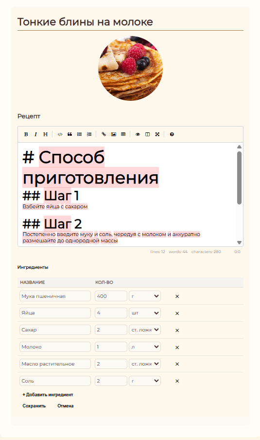
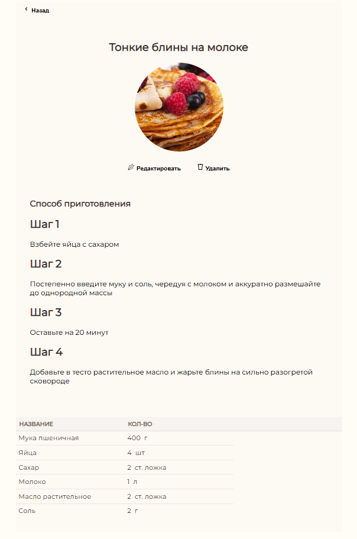
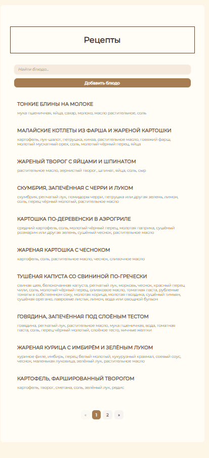

# 🍲 RecipeApp

Простое и стильное веб-приложение для создания, редактирования и просмотра рецептов. Построено на **Blazor WebAssembly**, использует **Entity Framework Core + SQLite**, поддержку **Markdown**, а также загрузку изображений.

## ✨ Возможности

- ✅ Добавление, редактирование и удаление рецептов
- 📷 Загрузка и предпросмотр изображений
- 📝 Удобный редактор рецептов с Markdown
- 🧮 Подсчёт нутриентов по ингредиентам
- 🔍 Современный интерфейс с адаптивной вёрсткой
- 🔐 Валидация формы при создании/редактировании рецепта

## 🖼️ Интерфейс

## 🚀 Технологии

- **Blazor WebAssembly**
- **Entity Framework Core** + **SQLite**
- **.NET 8**
- **Markdown редактор** (кастомный компонент)
- **CSS**
